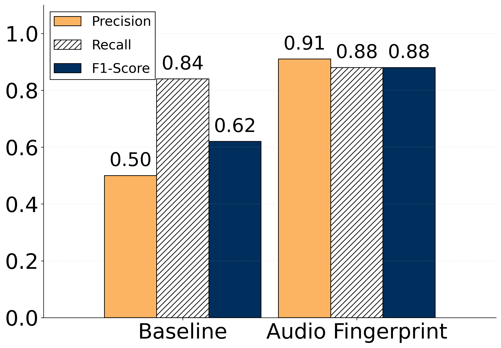
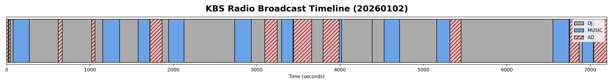
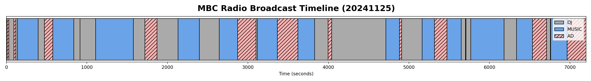
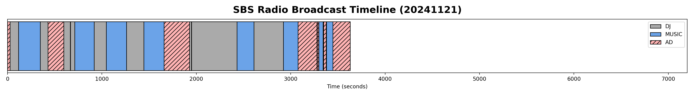

# Radio Advertisement Detection

> 장시간 라디오 방송에서 광고(AD) 블록을 분리·탐지하고, LLM으로 광고 메타데이터(회사명/제품명)를 추출하는 파이프라인.
> [Interspeech 2026 논문](./docs/paper.pdf) "Hybrid Role-Aware Structural Modeling and Semantic Extraction for Long-Form Radio Broadcasts"의 일부.
> 충남대학교 데이터네트워크 연구실 팀 프로젝트 — **이 repo는 제가 담당한 광고(AD) 분리·평가·LLM 추출 파트**입니다. (DJ/음악 분리는 팀원 담당)

## My Role

- **Panako 기반 cross-day audio fingerprint matching**으로 반복되는 광고 탐지 구현 (`panako/`)
- 여러 버전의 탐지 알고리즘 평가 (baseline → v4 → v5) 및 성능 비교 (`ad_evaluation/`, `ad_debug/`)
- GPT 기반 광고 회사명·제품명 추출 (`ad_evaluation/scripts/evaluate_individual_ads_v4_new.py`)

## Pipeline

```
panako/mp3-segmentation*.py        → 방송 mp3를 클립 단위로 분할
panako/build_db.sh + detector.py   → Fingerprint DB 구축
panako/seg-lookup3.py              → 클립별 panako query 실행
panako/cluster-max-v3.py           → 매칭 결과 클러스터링
panako/parse_panako_results_to_ads.py → AD 블록으로 변환
panako/whisper_ad_faster.py        → (검증용) 매칭된 클립 음성 전사 — faster-whisper
   ↓
ad_debug/scripts/evaluate_ad_block_panako_v5.py     → 제안 방법 평가 (F1 0.88)
[비교군] ad_evaluation/scripts/evaluate_ad_block_baseline.py → baseline 평가 (F1 0.62, 팀원의 DJ/Music/AD 블록 분류 결과를 그대로 평가한 비교군)
ad_evaluation/scripts/evaluate_individual_ads_v4_new.py → GPT 기반 개별 광고 매칭/추출 (F1 0.93, 회사·제품명)
ad_evaluation/scripts/make_radio_timeline.py        → 결과 시각화
```

> 입력 의존성: 화자 역할(DJ/Music/AD) 분류 결과는 팀원이 담당한 별도 모듈에서 생성됩니다.

## Results

30일치 KBS/MBC/SBS 라디오 방송 데이터 기준:

| 항목 | Baseline | 제안 방법 (Audio Fingerprint) |
|---|---|---|
| 광고 블록 탐지 F1 | 0.62 | **0.88** |
| 개별 광고 단위 F1 | - | **0.93** |

| 항목 | KBS | MBC | SBS | 평균 |
|---|---|---|---|---|
| 광고 메타데이터(회사/제품명) 추출 F1 | 0.82 | 0.73 | 0.79 | 0.78 |

### Visualizations

**탐지 성능 비교**


**라디오 방송 타임라인 (DJ/Music/AD 블록)**

KBS, MBC, SBS 세 방송사 각각의 방송 구조를 시각화한 결과입니다.





## Tech Stack
`Python` `Panako (Audio Fingerprinting)` `faster-whisper` `sentence-transformers` `GPT-4o` `pandas`

## How It Runs

> 원본 mp3와 fingerprint DB는 포함하지 않아 그대로 실행은 안 되지만, 각 단계의 명령어는 다음과 같습니다.

```bash
# 1. 방송 mp3를 클립 단위로 분할
python panako/mp3-segmentation-noon.py

# 2. Fingerprint DB 구축 (panako CLI 필요)
bash panako/build_db.sh

# 3. 전날 방송 대비 cross-day 매칭
python panako/seg-lookup3.py
python panako/cluster-max-v3.py
python panako/parse_panako_results_to_ads.py

# 4. (선택) 매칭된 광고 클립 검증용 전사 — faster-whisper
python panako/whisper_ad_faster.py

# 5. 탐지 성능 평가
python ad_debug/scripts/evaluate_ad_block_panako_v5.py
python ad_evaluation/scripts/evaluate_ad_block_baseline.py

# 6. 개별 광고 매칭 + GPT 기반 회사명·제품명 추출
python ad_evaluation/scripts/evaluate_individual_ads_v4_new.py

# 7. 결과 시각화
python ad_evaluation/scripts/make_radio_timeline.py
```

## Note
원본 라디오 mp3와 Panako fingerprint DB는 용량(수십 GB) 및 저작권 문제로 제외했습니다. 코드와 평가 결과만 포함되어 있습니다.